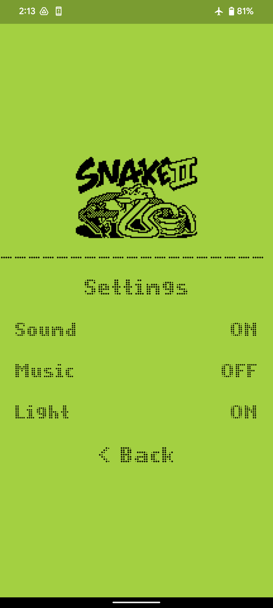
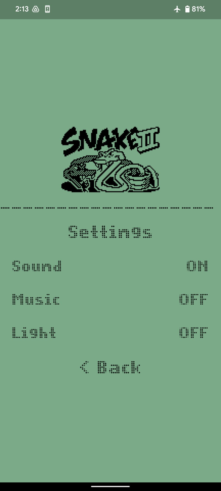
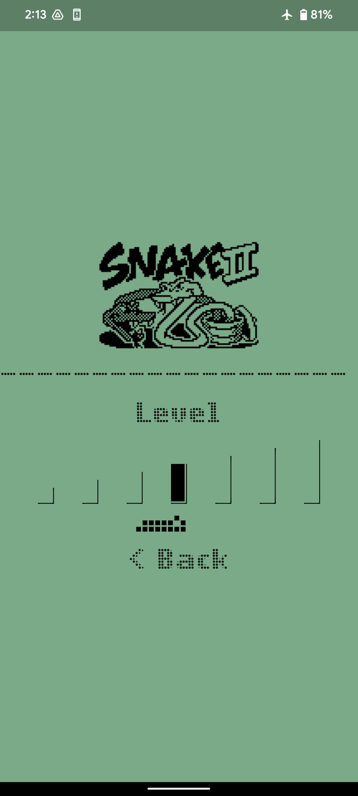
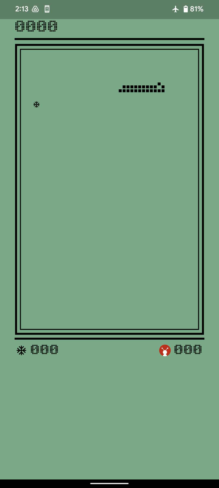
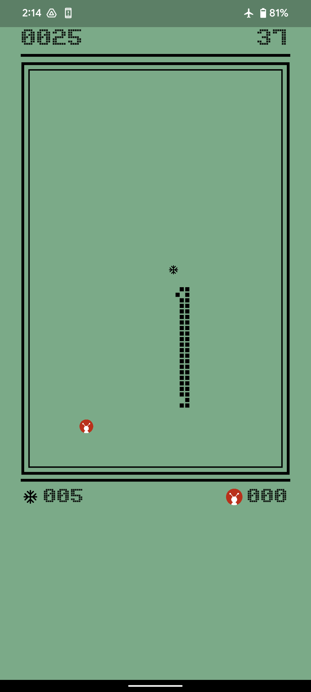
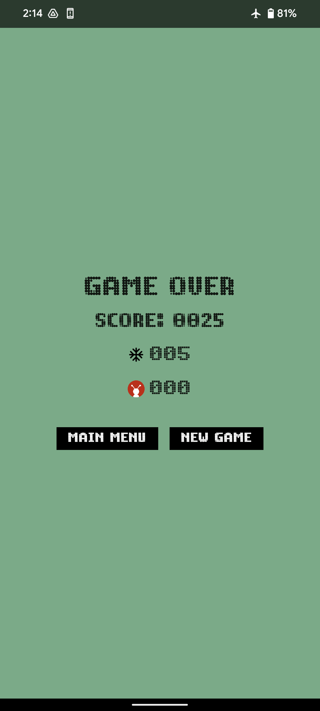
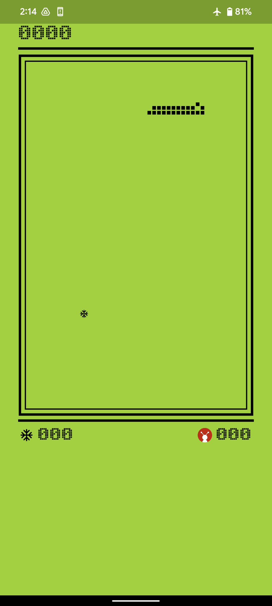

# Snake Game Clasic

<h4>The game is a remake of the original Snake II with pixel graphics and monophonic sounds. The goal is to make as many points as possible by making the snake eat stuff that shows up. The more you eat the longer will the snake grow. If the snake collides with itself the game ends.</h4>
 

https://user-images.githubusercontent.com/62005727/189520029-0142f74a-266a-4ee7-bb24-1e10ab8ab103.mp4

 

## Food Points

* 

  

  
  

  
<h2>5 Points</h2>
 
  

* 

  

  

  
<h2>20 Points</h2>
 

## Features
  * Change Snake speed
  * Switch between Light OFF or ON
  * Keyboard and Touch drag controlled
  * Snake Theme song and, food eat and die sound effect
  
## Controlls
  * Mouse Drag for navigation on touch screens
  * Keyboard 
     * Arrow keys Or `A W S D` for navigation 
     * `esc` for back

## Screenshots

  
  
  
  
  
  
  

